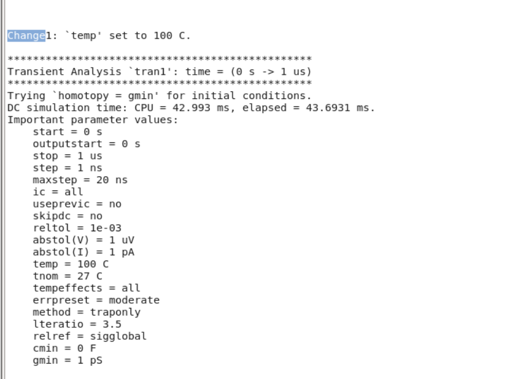
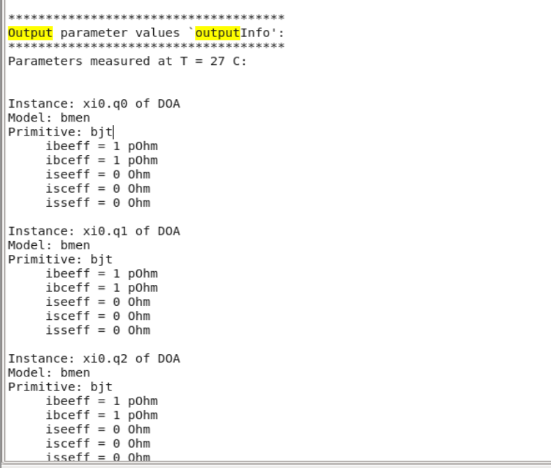
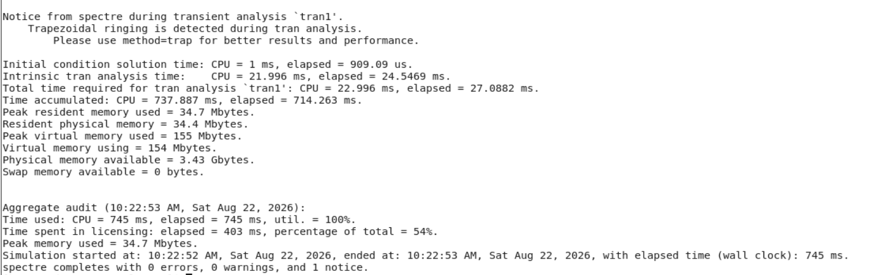
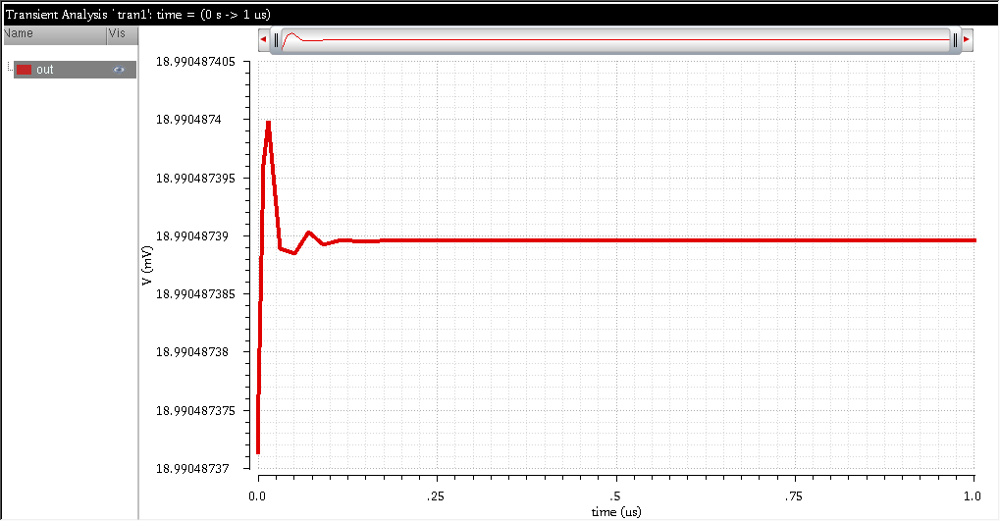

# Spectre: Control Statements

A minimalistic demonstration of using control statements in Cadence Spectre to dynamically change simulation parameters, extract specific output data, and profile simulation performance.

## 1. Dynamic Parameter Modification (`alter`)
The `alter` statement allows for changing global parameters (such as temperature) or specific device properties between distinct analysis runs without restarting the simulator.

```spectre
// DC analysis at nominal temperature
dc1 dc oppoint=logfile homotopy=gmin 

// Change temperature and run transient analysis
Change1 alter param=temp value=100
tran1 tran stop=1u
```


---

## 2. Output Data Extraction (`info`)
The `info` statement is used to print specific component parameters, operating points, or model parameters to a designated destination (like the logfile).

```spectre
outputInfo info what=output where=logfile 
```


---

## 3. Profiling Performance (`simstat`)
By setting `simstat=detailed` in the standard options block, Spectre generates an in-depth breakdown of memory usage, matrix solving, and CPU time after the analysis completes.

```spectre
simOptions options simstat=detailed
```


---

## 4. Output Data & Visualization
Transient outputs can be routed to raw text or CSV formats for external processing, or viewed natively.

*   `tran1.out`: Standard text-based output generated from the simulation.
*   `out_value_from_raw_output.csv`: Tabular export of the voltage values.



---
*Maintained by: TheVoltageVikingRam*
