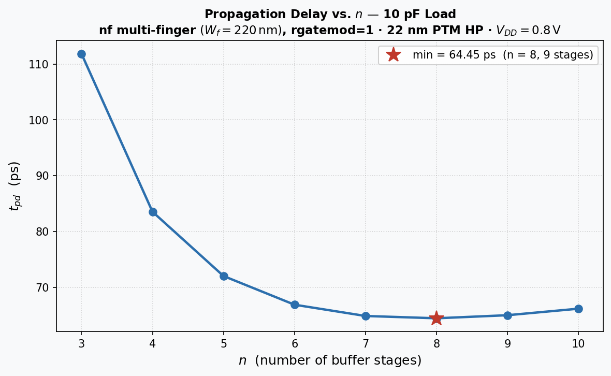

# 10 pF CMOS Inverter Chain Delay Study

A propagation-delay optimisation study for a geometrically tapered CMOS inverter chain
driving a **10 pF** load, using a **22 nm PTM HP BSIM4 model**.

---

## Simulation Parameters

| Parameter | Value |
|---|---|
| Supply voltage | $V_{DD} = 0.8\text{ V}$ |
| Load capacitance | $C_L = 10\text{ pF}$ |
| Channel length | $L = 22\text{ nm}$ |
| Base NMOS width | $W_n = 2L = 44\text{ nm}$ |
| PMOS/NMOS ratio | $k = 1.3$ |
| Gate poly sheet resistance | $\texttt{rshg} = 0.4\;\Omega/\square$ |
| Max finger width | $W_f = 220\text{ nm}$ |
| Measurement threshold | $V_{DD}/2 = 0.4\text{ V}$ |
| $C_{in}$ (min. inverter, Exercise 4) | $0.0732\text{ fF}$ |
| $M = C_L / C_{in}$ | $136{,}612$ |

---

## Methodology — `nf` Multi-finger Partitioning (`rgatemod = 1`)

For $n$ buffer stages (chain has $n+1$ inverters, indexed $0 \ldots n$), the geometric
tapering factor is

$$
\alpha = \left(\frac{C_L}{C_{in}}\right)^{\!\!1/(n+1)} = M^{1/(n+1)}.
$$

Stage $i$ is scaled by $\alpha^i$ relative to the minimum-size inverter. The total
transistor widths at stage $i$ are

$$
W_{n,\text{tot}} = W_n\,\alpha^i, \qquad W_{p,\text{tot}} = k\,W_n\,\alpha^i,
$$

and the finger counts are

$$
NF_n = \left\lceil \frac{W_{n,\text{tot}}}{W_f} \right\rceil, \qquad
NF_p = \left\lceil \frac{W_{p,\text{tot}}}{W_f} \right\rceil.
$$

Gate resistance is enabled (`rgatemod = 1`) and controlled by the finger width constraint:
each finger is at most $W_f = 220\text{ nm}$ wide, keeping $R_g \propto W_f^2$ small.

Propagation delay is measured as

$$
t_{pd} = \frac{t_{PHL} + t_{PLH}}{2}.
$$

---

## Netlist Subcircuit

```spectre
subckt inv ( in out vdd vss )
parameters L=22n Wn=2*L k=1.3 mult=1 wf=220n

parameters Wtot_n=Wn*mult
parameters Wtot_p=k*Wn*mult

parameters nf_n=max(1,ceil(Wtot_n/wf))
parameters nf_p=max(1,ceil(Wtot_p/wf))

m1 ( out in vdd vdd ) pmos l=L w=Wtot_p nf=nf_p
m2 ( out in vss vss ) nmos l=L w=Wtot_n nf=nf_n

ends inv
```

---

## Alpha Values Used

| $n$ | Stages | $\alpha = M^{1/(n+1)}$ |
| -: | -: | -: |
| 3 | 4 | 19.225260349 |
| 4 | 5 | 10.643826428 |
| 5 | 6 | 7.176535208 |
| 6 | 7 | 5.415533842 |
| 7 | 8 | 4.384661942 |
| **8** | **9** | **3.720573427** |
| 9 | 10 | 3.262487767 |
| 10 | 11 | 2.929966326 |

---

## Results

| $n$ | Stages | $\alpha$ | $t_{pd}$ (ps) |
| -: | -: | -: | -: |
| 3 | 4 | 19.225260349 | 111.84 |
| 4 | 5 | 10.643826428 | 83.53 |
| 5 | 6 | 7.176535208 | 72.02 |
| 6 | 7 | 5.415533842 | 66.88 |
| 7 | 8 | 4.384661942 | 64.86 |
| **8** | **9** | **3.720573427** | **64.45** |
| 9 | 10 | 3.262487767 | 65.00 |
| 10 | 11 | 2.929966326 | 66.17 |

$$
\boxed{t_{pd,\min} = 64.45\text{ ps at }n = 8\text{ (9-stage chain)}}
$$

---

## Plot



The delay curve falls steeply from $n = 3$ and reaches a broad minimum at
$n = 8$ (9 stages), after which stage-count overhead begins to increase delay again.

---

## Summary

| Parameter | Value |
|---|---|
| Optimal $n$ | **8** |
| Optimal stage count | **9** |
| Minimum $t_{pd}$ | **64.45 ps** |
| Optimal $\alpha$ | **3.720573427** |
| Method | `nf` multi-finger, `rgatemod = 1` |

---

## Comparison with 1 pF Case

| | $C_L = 1\text{ pF}$ | $C_L = 10\text{ pF}$ |
|---|---|---|
| $M = C_L/C_{in}$ | 13,661 | 136,612 |
| Optimal $n$ | 6 | **8** |
| Optimal stages | 7 | **9** |
| Min $t_{pd}$ | 51.16 ps | **64.45 ps** |
| Optimal $\alpha$ | 3.897 | **3.721** |

With 10x the load, the optimal chain depth increases by 2 stages and the minimum
delay rises by ~13 ps (~26%). The optimal $\alpha$ decreases slightly (from 3.90 to 3.72),
consistent with the $M^{1/(n+1)}$ scaling -- more stages share the larger load.
