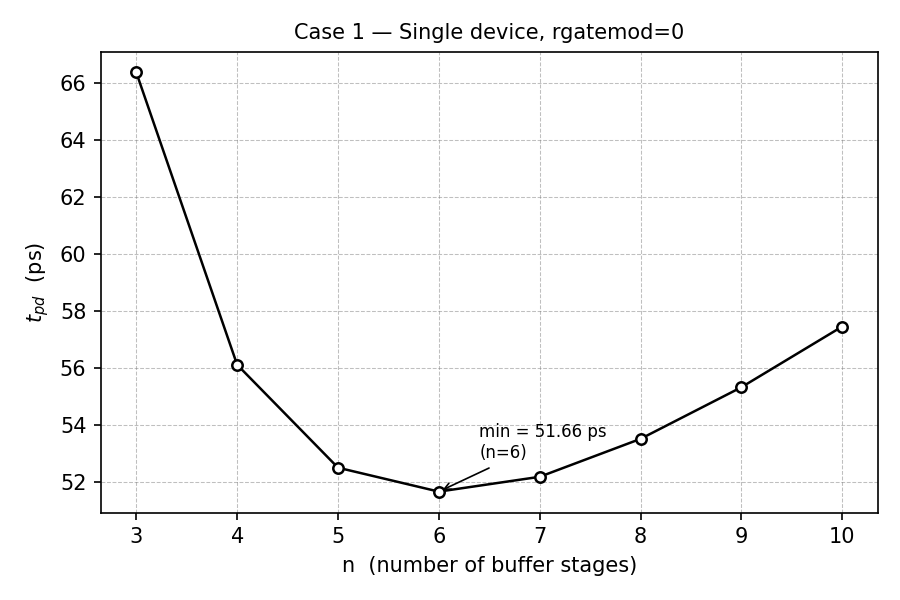
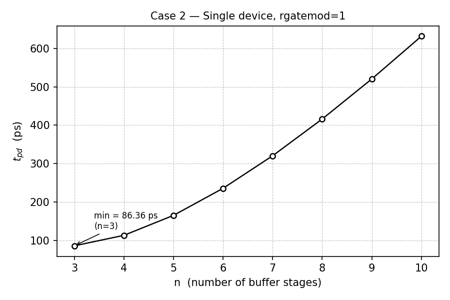
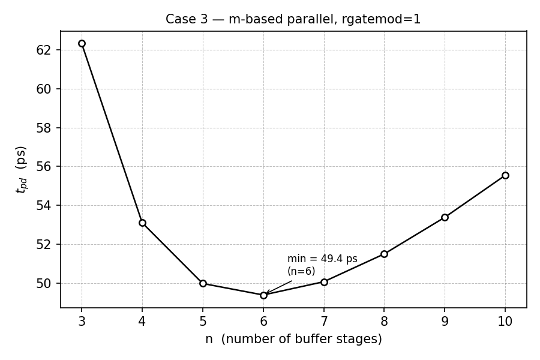
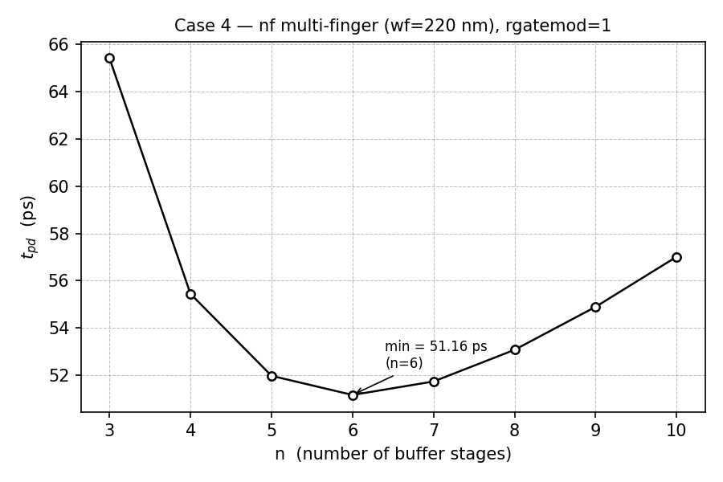
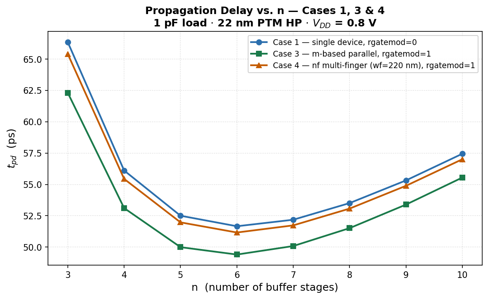

# 1 pF CMOS Inverter Chain Delay Study

A comparative study of propagation delay in a geometrically tapered CMOS inverter chain
using a **22 nm PTM HP BSIM4 model**.

## Simulation Parameters

| Parameter | Value |
|---|---|
| Supply voltage | $V_{DD} = 0.8\text{ V}$ |
| Load capacitance | $C_L = 1\text{ pF}$ |
| Channel length | $L = 22\text{ nm}$ |
| Base NMOS width | $W_n = 2L = 44\text{ nm}$ |
| PMOS/NMOS ratio | $k = 1.3$ |
| Gate poly sheet resistance | $\texttt{rshg} = 0.4\;\Omega/\square$ |
| Tapering | Geometric |
| Measurement threshold | $V_{DD}/2 = 0.4\text{ V}$ |

For each value of $n$, the chain contains $n+1$ inverter stages, with stage $i$ scaled by

$$
W_i = W_0\,\alpha^i, \qquad \alpha = \left(\frac{C_L}{C_{in}}\right)^{1/n}.
$$

Propagation delay is measured as

$$
t_{pd} = \frac{t_{PHL} + t_{PLH}}{2}.
$$

---

## Case 1 — Single-device, `rgatemod = 0`

Gate-resistance effects are **disabled**. The total transistor width is set directly in the
`w` parameter of each MOS device and scaled with the geometric multiplier.

**Netlist (subckt):**
```spectre
subckt inv ( in out vdd vss )
parameters L=22n Wn=2*L k=1.3 mult=1
m1 ( out in vdd vdd ) pmos l=L w=k*Wn*mult
m2 ( out in vss vss ) nmos l=L w=Wn*mult
ends inv
```

| $n$ | Stages | $\alpha$ | $t_{pd}$ (ps) |
| -: | -: | -: | -: |
| 3 | 4 | 10.810515 | 66.36 |
| 4 | 5 | 6.715481 | 56.11 |
| 5 | 6 | 4.889123 | 52.50 |
| **6** | **7** | **3.897350** | **51.66** |
| 7 | 8 | 3.287935 | 52.18 |
| 8 | 9 | 2.880629 | 53.51 |
| 9 | 10 | 2.591424 | 55.32 |
| 10 | 11 | 2.376535 | 57.45 |

$$
\boxed{t_{pd,\min} = 51.66\text{ ps at }n = 6}
$$



---

## Case 2 — Single-device, `rgatemod = 1`

Gate-resistance effects are **enabled** via the BSIM4 distributed gate-resistance model.
The transistors are still represented as a **single wide device** with no fingering.
With `rshg = 0.4 Ohm/sq`, the gate resistance grows as $R_g \propto W^2$, producing
a strong delay penalty in the large final stages.

**Netlist (subckt):** identical to Case 1, but with `+rgatemod=1` set in the model.

| $n$ | Stages | $\alpha$ | $t_{pd}$ (ps) |
| -: | -: | -: | -: |
| 3 | 4 | 10.810515 | 86.36 |
| 4 | 5 | 6.715481 | 113.60 |
| 5 | 6 | 4.889123 | 165.54 |
| 6 | 7 | 3.897350 | 235.95 |
| 7 | 8 | 3.287935 | 320.61 |
| 8 | 9 | 2.880629 | 416.20 |
| 9 | 10 | 2.591424 | 520.41 |
| 10 | 11 | 2.376535 | 631.53 |

Delay increases monotonically across the tested range; $n = 3$ gives the lowest value.

$$
\boxed{t_{pd,\min} = 86.36\text{ ps at }n = 3 \text{ (lower bound of sweep, not a true optimum)}}
$$



---

## Case 3 — `m`-based parallel multiplicity, `rgatemod = 1`

The geometric scaling is implemented using the MOS `m` (multiplicity) parameter,
keeping the **base device width unchanged** and replicating it in parallel.
Each replica is only $W_n = 44\text{ nm}$ wide, so the gate resistance per unit stays small.

**Netlist (subckt):**
```spectre
subckt inv ( in out vdd vss )
parameters L=22n Wn=2*L k=1.3 mult=1
m1 ( out in vdd vdd ) pmos l=L w=k*Wn m=mult
m2 ( out in vss vss ) nmos l=L w=Wn   m=mult
ends inv
```

For stage $i$, $m_i = \alpha^i$.

| $n$ | Stages | $\alpha$ | Final-stage $m_n = \alpha^n$ | $t_{pd}$ (ps) |
| -: | -: | -: | -: | -: |
| 3 | 4 | 10.810515 | 1263.39 | 62.32 |
| 4 | 5 | 6.715481 | 2033.80 | 53.11 |
| 5 | 6 | 4.889123 | 2793.54 | 49.99 |
| **6** | **7** | **3.897350** | **3504.42** | **49.40** |
| 7 | 8 | 3.287935 | 4153.96 | 50.08 |
| 8 | 9 | 2.880629 | 4741.31 | 51.51 |
| 9 | 10 | 2.591424 | 5270.44 | 53.39 |
| 10 | 11 | 2.376535 | 5747.00 | 55.55 |

$$
\boxed{t_{pd,\min} = 49.40\text{ ps at }n = 6}
$$



---

## Case 4 — `nf` multi-finger partitioning, `rgatemod = 1`

The geometric scaling is implemented using **multi-finger MOS devices**.
For each stage $i$, the required total widths are

$$
W_{n,\text{tot}} = W_n\,\alpha^i, \qquad W_{p,\text{tot}} = k\,W_n\,\alpha^i.
$$

These are partitioned into fingers using a maximum finger-width constraint
$W_f = 220\text{ nm}$:

$$
NF_n = \left\lceil \frac{W_{n,\text{tot}}}{220\text{ nm}} \right\rceil, \qquad
NF_p = \left\lceil \frac{W_{p,\text{tot}}}{220\text{ nm}} \right\rceil.
$$

**Netlist (subckt):**
```spectre
subckt inv ( in out vdd vss )
parameters L=22n Wn=2*L k=1.3 mult=1 wf=220n

parameters Wtot_n=Wn*mult
parameters Wtot_p=k*Wn*mult

parameters nf_n=max(1,ceil(Wtot_n/wf))
parameters nf_p=max(1,ceil(Wtot_p/wf))

m1 ( out in vdd vdd ) pmos l=L w=Wtot_p nf=nf_p
m2 ( out in vss vss ) nmos l=L w=Wtot_n nf=nf_n

ends inv
```

| $n$ | Stages | $\alpha$ | $t_{pd}$ (ps) |
| -: | -: | -: | -: |
| 3 | 4 | 10.810515 | 65.42 |
| 4 | 5 | 6.715481 | 55.44 |
| 5 | 6 | 4.889123 | 51.97 |
| **6** | **7** | **3.897350** | **51.16** |
| 7 | 8 | 3.287935 | 51.73 |
| 8 | 9 | 2.880629 | 53.07 |
| 9 | 10 | 2.591424 | 54.89 |
| 10 | 11 | 2.376535 | 57.01 |

$$
\boxed{t_{pd,\min} = 51.16\text{ ps at }n = 6}
$$



---

## Comparative Analysis — Cases 1, 3 & 4



The three cases are compared here not just by simulated delay but by **modeling effort and
physical accuracy** — i.e., how much work the designer has to do to set up the netlist, and
how faithfully it represents what will actually be built in layout.

| Dimension | Case 1 | Case 3 | Case 4 |
|---|---|---|---|
| **Setup effort** | ★ Easiest — scale `w` directly | Medium — set `m` parameter | ✗ Most involved — compute $NF = \lceil W_{tot}/W_f \rceil$ per stage |
| **Physical accuracy** | ✗ Least accurate — gate resistance ignored (`rgatemod=0`) | More accurate — `m` keeps unit device small, $R_g$ negligible | ✓ Most layout-representative — fingers match real layout partitioning |
| **Layout fidelity** | Low — single wide device doesn't reflect fingering | Medium — parallel units, but no explicit finger geometry | High — $W_f = 220\text{ nm}$ fingers mirror actual drawn geometry |
| **Gate resistance model** | Disabled | Enabled, naturally mitigated by small unit $W$ | Enabled, explicitly controlled via finger width |
| **Min $t_{pd}$** | 51.66 ps | **49.40 ps** | 51.16 ps |

**Case 1** is the quickest to write — you just scale the single `w` parameter and run. No
gate-resistance modelling means it is the least physically accurate, but it is a useful
first-pass baseline.

**Case 3** strikes a good balance: adding `m` instead of growing `w` keeps each unit device
at $W_n = 44\text{ nm}$, which naturally limits gate resistance without any extra bookkeeping.
It is more accurate than Case 1 with almost no additional effort.

**Case 4** demands the most from the designer: for every stage and device type, you must
compute the total width, apply a ceiling to get the finger count $NF$, and set both `w` and
`nf` explicitly. This extra work is rewarded with the closest correspondence to what a real
layout looks like — fingered devices with a maximum finger width constraint directly reflect
the physical design rules used in tape-out.

---

## Summary

| Case | Implementation | `rgatemod` | Optimal $n$ | Stages | Min $t_{pd}$ |
| --- | --- | -: | -: | -: | -: |
| 1 | Single wide device | 0 | 6 | 7 | 51.66 ps |
| 2 | Single wide device | 1 | 3* | 4 | 86.36 ps |
| 3 | `m`-based parallel multiplicity | 1 | 6 | 7 | **49.40 ps** |
| 4 | `nf` multi-finger ($W_f = 220\text{ nm}$) | 1 | 6 | 7 | 51.16 ps |

\*Case 2 delay increases monotonically across $n = 3$–$10$; $n = 3$ is the
lowest-delay point within the tested range, not a true optimum.

## Key Observations

1. **Case 2 confirms the gate-resistance hazard.** A single wide device with `rgatemod=1`
   causes delay to grow monotonically with $n$, because larger $\alpha$ means a wider
   final device and proportionally larger $R_g \propto W^2$.

2. **Case 3 (`m`-based) gives the lowest measured delay (49.40 ps)**, beating even the
   `rgatemod=0` baseline. The `m` parameter keeps each unit device at $W_n = 44\text{ nm}$
   so gate resistance per unit stays negligible, while BSIM4 correctly aggregates
   current and capacitance across the $m$ parallel copies.

3. **Case 4 (`nf` multi-finger, 51.16 ps) is close to but slightly worse than Case 3.**
   With $W_f = 220\text{ nm}$ fingers, each finger accrues two additional source/drain
   diffusion edges, adding junction capacitance. Because `rshg = 0.4 Ohm/sq` makes
   gate resistance very small even for a single wide device at 22 nm, the junction-cap
   penalty of fine fingering is non-negligible relative to the gate-RC benefit.

4. **All three well-behaved cases share the same optimal chain depth:** $n = 6$ (7 stages),
   consistent with the branching-effort optimum for this load ratio.
