# Exercise 1 — CMOS Inverter Chain

A 7-stage CMOS inverter chain was simulated using Spectre with the 22-nm PTM HP model.

For the initial smoke test:

- `k = 2`
- `L = 22 nm`
- `Wn = 44 nm`
- `Wp = 88 nm`
- `VDD = 1 V`

Propagation delays were measured graphically at the 50% `VDD` crossing.

## Initial Smoke Test — k = 2

| Parameter | Graphical value |
|---|---:|
| `tPHL` | ≈ 1.9286 ps |
| `tPLH` | ≈ 2.668 ps |

Thus:

$$
t_{PLH} > t_{PHL}
$$

### Graphical Measurements

| `tPHL` | `tPLH` |
|---|---|
| 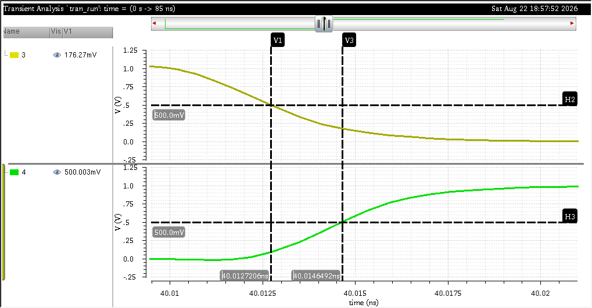 | 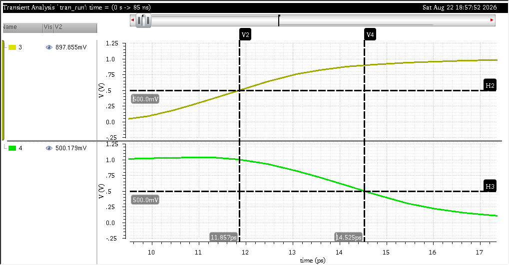 |

## Part A — Sweep of k

`k` was swept from `1` to `2` in steps of `0.1`, and `tPHL` and `tPLH` were measured for each value.

### Sweep Result

| Spectre Result | Python Generated Result |
|---|---|
| 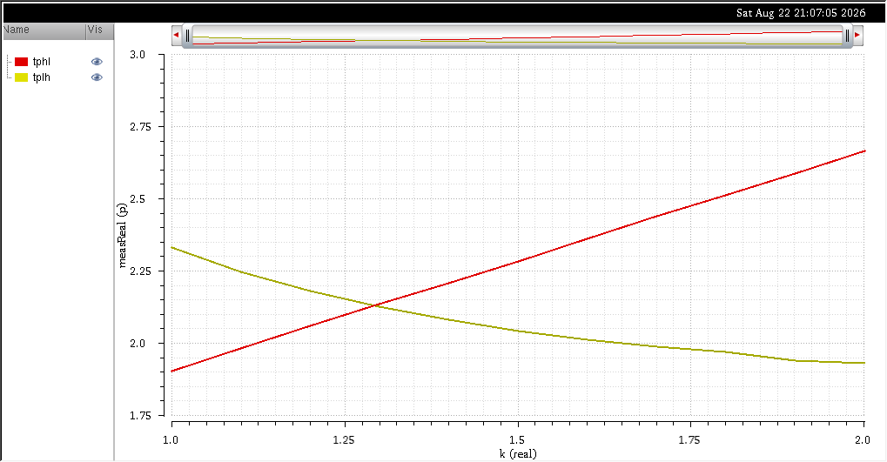 | 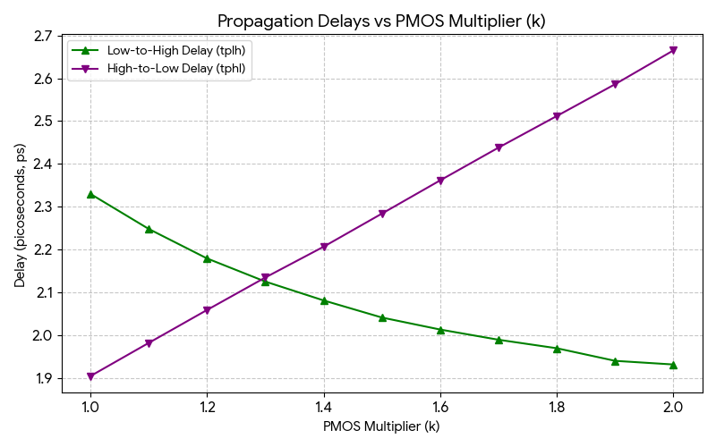 |

The intersection of the two curves gives approximately:

$$
k \approx 1.293
$$

At this point:

$$
t_{PHL} \approx t_{PLH} \approx 2.13\ \text{ps}
$$

### Calculator Utility Result

The intersection was also obtained using the Spectre calculator:

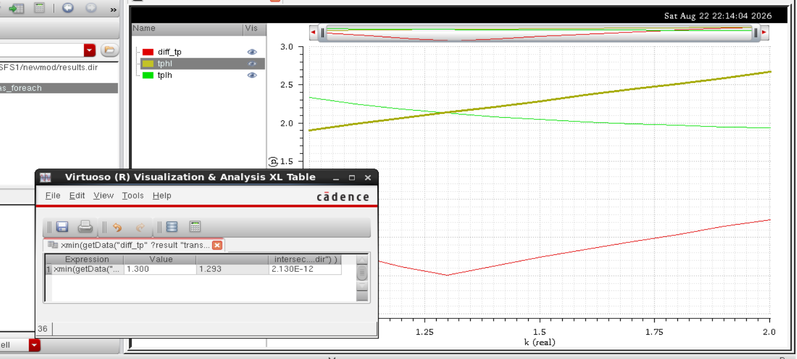

The calculator gives:

$$
\boxed{k \approx 1.293}
$$

with the corresponding delay of approximately:

$$
\boxed{2.13\ \text{ps}}
$$

The sweep data is also provided as a CSV file:

[`tplh_vs_tphl_as_func_of_k.csv`](./tplh_vs_tphl_as_func_of_k.csv)

### Rise and Fall Time Analysis

Similarly, `t_rise` and `t_fall` were measured as `k` was swept.

| Spectre Result | Python Generated Result |
|---|---|
| 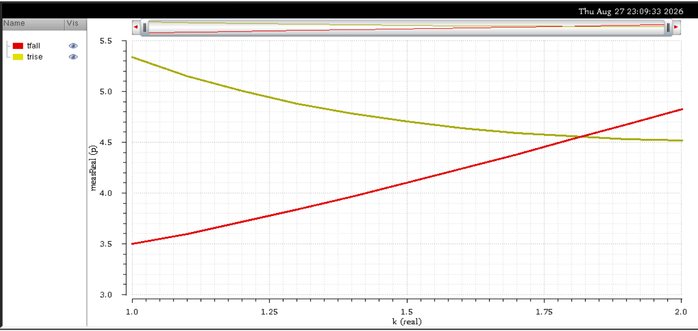 | 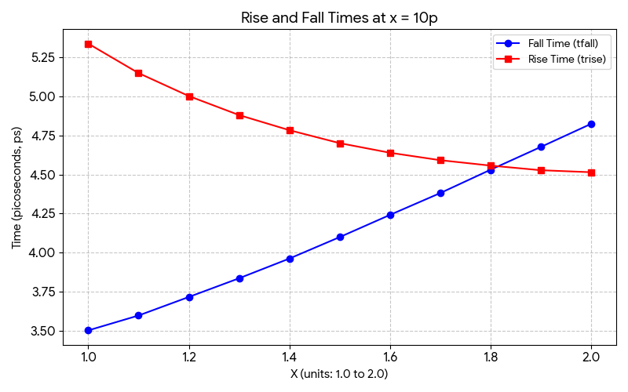 |

The intersection of the two curves gives approximately:

$$
k \approx 1.82
$$

At this point:

$$
t_{rise} \approx t_{fall} \approx 4.55\ \text{ps}
$$

The sweep data for rise and fall times is also provided as a CSV file:

[`trise_tfall_at_x_equal_to10p.csv`](./trise_tfall_at_x_equal_to10p.csv)

## Part B — Sweep of X for Rise and Fall Times

In this part, `X` was varied, and `t_rise` and `t_fall` were measured to find the point where they intersect.

### Sweep Result

| Spectre Result & Calculator Utility | Python Generated Result |
|---|---|
| 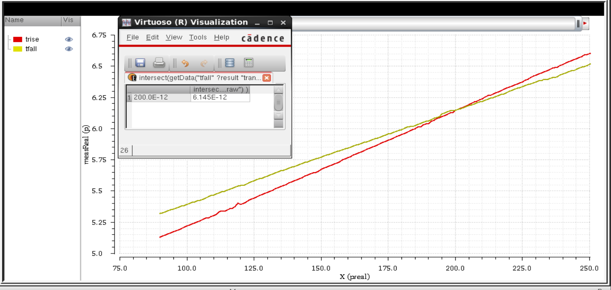 | 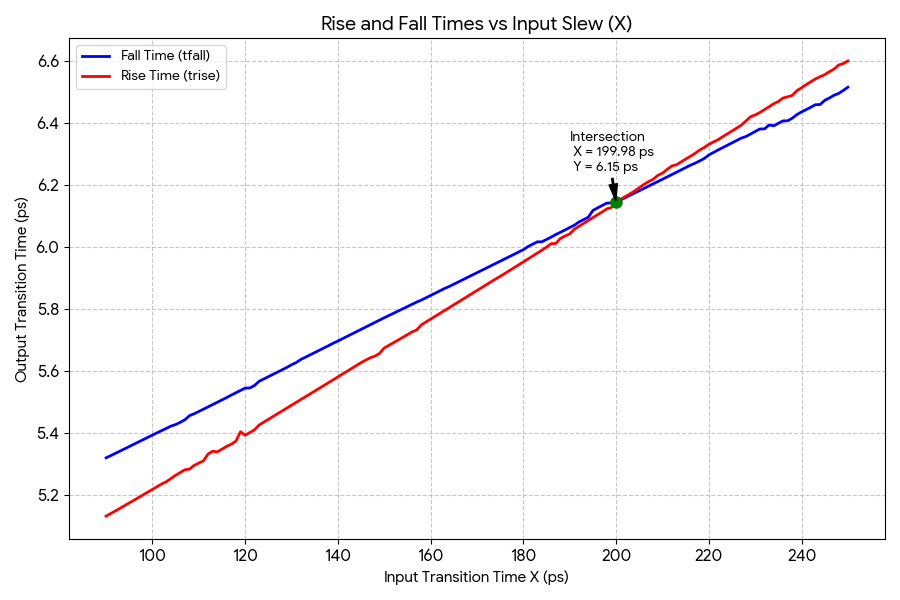 |

The intersection of the two curves gives approximately:

$$
X \approx 2 \times 10^{-10}
$$

At this point, the rise and fall times are equal:

$$
t_{rise} \approx t_{fall} \approx 6.145\ \text{ps}
$$

The sweep data for this analysis is provided as a CSV file:

[`trise_tfall_as_X_is_varied.csv`](./trise_tfall_as_X_is_varied.csv)

## Part C — Sweep of k at Symmetric X Value

Using the symmetric `X` value obtained from Part B ($X \approx 6.145\ \text{ps}$), `k` was swept again from `1` to `10` in steps of 0.05 and both propagation delays and rise/fall times were measured.

### tPHL vs tPLH

| Spectre Result | Python Generated Result |
|---|---|
| 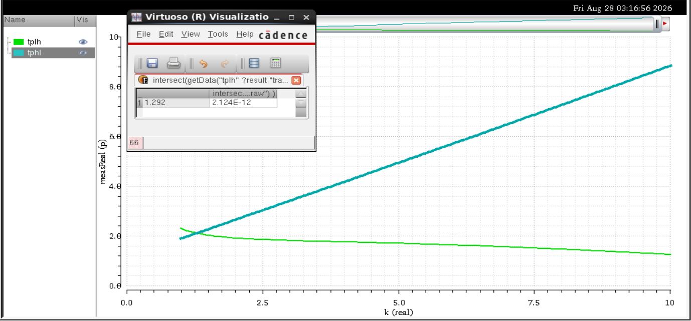 | 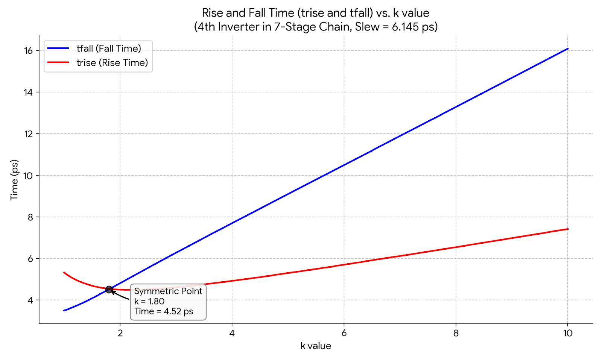 |

The intersection of `tPHL` and `tPLH` gives approximately:

$$
k \approx 1.292
$$

At this point:

$$
t_{PHL} \approx t_{PLH} \approx 2.124\ \text{ps}
$$

The sweep data is provided as a CSV file:

[`tplh_vs_tphl_at_X_symmetric_value.csv`](./tplh_vs_tphl_at_X_symmetric_value.csv)

### trise vs tfall

| Spectre Result | Python Generated Result |
|---|---|
| 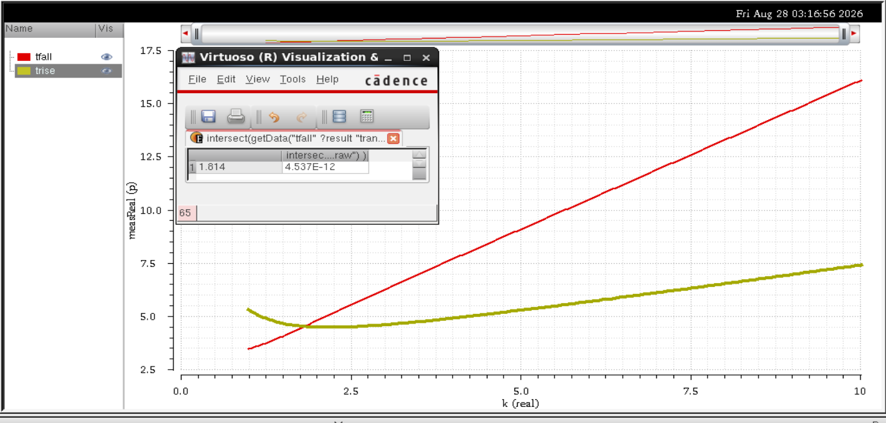 | 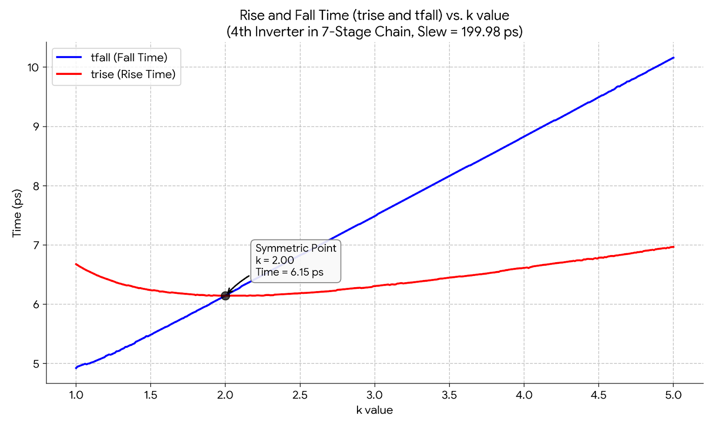 |

The intersection of `t_rise` and `t_fall` gives approximately:

$$
k \approx 1.814
$$

At this point:

$$
t_{rise} \approx t_{fall} \approx 4.537\ \text{ps}
$$

The sweep data is provided as a CSV file:

[`trise_vs_tfall_at_X_symmetric_value.csv`](./trise_vs_tfall_at_X_symmetric_value.csv)
