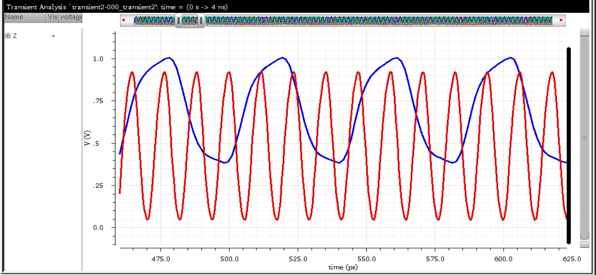
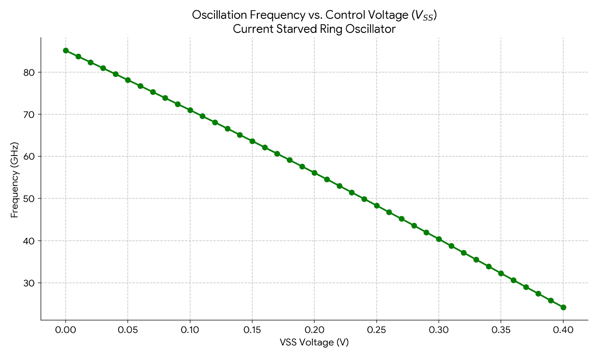

# Exercise 2 — Ring Oscillator

Simulated using Spectre with the 22-nm PTM HP model.

- `k = 1.293` (symmetric delay value from Exercise 1)
- `L = 22 nm`
- `Wn = 44 nm`
- `VDD = 1 V`

---

## Part 2A — 21-Stage Ring Oscillator

21 inverters in a feedback loop. Output of inverter 21 feeds back to input of inverter 1.

### SPICE `.measure` Results

| Parameter | Value |
|---|---:|
| `time_period` | 89.385 ps |
| `tPHL` | 2.1287 ps |
| `tPLH` | 2.1287 ps |

As expected, $t_{PHL} \approx t_{PLH}$ since $k = 1.293$.

### Graphical Measurements

| $t_{PHL}$ | $t_{PLH}$ |
|---|---|
|  |  |

$$
t_{PHL} \approx 776.4239 - 774.2987 = 2.125\ \text{ps}
$$

$$
t_{PLH} \approx 2.13\ \text{ps}
$$

### Oscillation Period

$$
T = 863.6816 - 774.2987 = 89.383\ \text{ps}
$$

### Python Verification

| Parameter | Python Value |
|---|---:|
| $t_{PLH}$ | ≈ 2.18 ps |
| $t_{PHL}$ | ≈ 2.13 ps |
| $T_{PERIOD}$ | ≈ 89.38 ps |

### Answer

**Find T of the oscillator:**

$$
\boxed{T = 89.385\ \text{ps}} \qquad f_{osc} = \frac{1}{T} \approx 11.19\ \text{GHz}
$$

**Verify $T = 42 \cdot t_{PLH} = 42 \cdot t_{PHL}$:**

For $N = 21$ stages: $T = 2N \cdot t_p = 42 \cdot t_p$.

$$
42 \times 2.1287 = 89.405\ \text{ps} \approx T_{measured} = 89.385\ \text{ps} \quad \checkmark
$$

The transient waveform data is provided as a CSV file:

[`T_PERIOD_TPLH_TPHL.csv`](./T_PERIOD_TPLH_TPHL.csv)

---

## Part 2B — 3-Stage Current-Starved Ring Oscillator

3 inverters in a feedback loop. $V_{SS}$ swept from 0 V to 0.4 V to current-starve the NMOS transistors.

### Transient Waveform

With only 3 stages the output is more sinusoidal — not enough gain stages for sharp rail-to-rail transitions.

### Oscillation Frequency vs $V_{SS}$

| $V_{SS}$ (V) | Period (ps) | Frequency (GHz) |
|---:|---:|---:|
| 0.00 | 11.74 | 85.2 |
| 0.10 | 14.08 | 71.0 |
| 0.20 | 17.82 | 56.1 |
| 0.30 | 24.76 | 40.4 |
| 0.40 | 41.35 | 24.2 |

### Answer

As $V_{SS}$ increases, NMOS $V_{GS}$ drops, limiting pull-down current and slowing oscillation:

$$
\frac{f_{max}}{f_{min}} = \frac{85.2}{24.2} \approx 3.52 \times \text{ tuning range}
$$

The sweep data is provided as a CSV file:

[`ring_osc_3_time_period.csv`](./ring_osc_3_time_period.csv)
