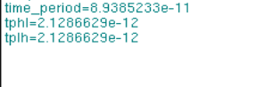
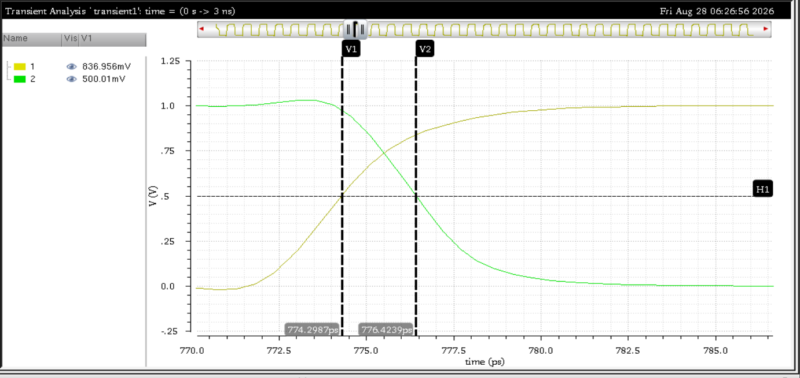
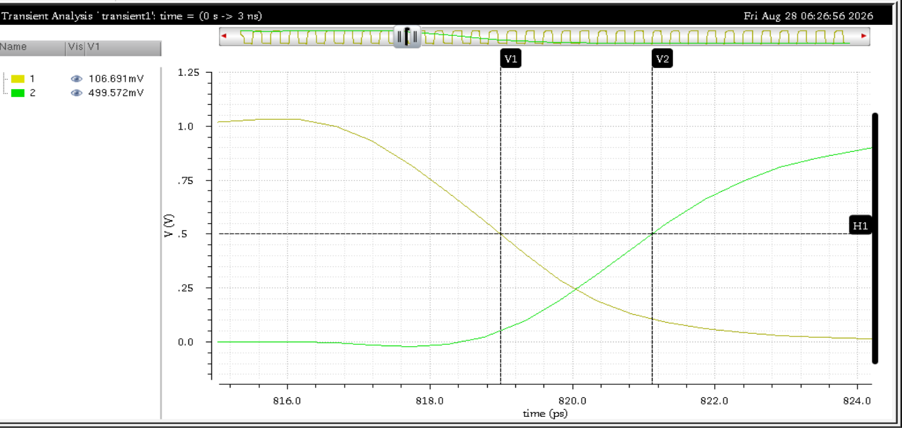
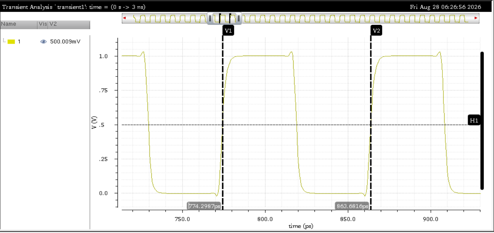
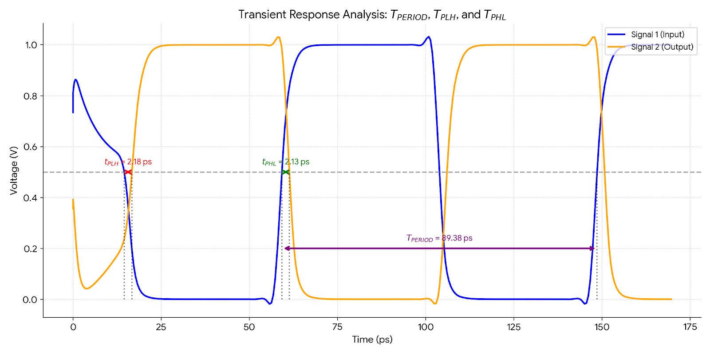

# Exercise 2 — Ring Oscillator (Part 2A)

A 21-stage CMOS ring oscillator was simulated using Spectre with the 22-nm PTM HP model.

## Circuit Configuration

- **Topology:** 21-stage ring oscillator (odd number of inverters with feedback)
- `k = 1.293` (symmetric propagation delay value from Exercise 1, Part A)
- `L = 22 nm`
- `Wn = 44 nm`
- `Wp = k × Wn = 56.892 nm`
- `VDD = 1 V`

The output of inverter 21 feeds back to the input of inverter 1, forming a closed loop. With an odd number of stages, the circuit is inherently unstable and oscillates.

No external input stimulus is required — the ring oscillator is self-starting.

## SPICE `.measure` Results

The following measurements were obtained using Spectre's built-in `.measure` facility:

| Parameter | Value |
|---|---:|
| `time_period` | 89.385 ps |
| `tPHL` | 2.1287 ps |
| `tPLH` | 2.1287 ps |

As expected, $t_{PHL} \approx t_{PLH}$ since $k = 1.293$ was chosen specifically for symmetric propagation delay in Exercise 1.

## Graphical Measurements

Propagation delays and oscillation period were also verified graphically at the 50% $V_{DD}$ crossing using markers in the Spectre waveform viewer.

### $t_{PHL}$ Measurement

Markers placed at consecutive 50% $V_{DD}$ crossings on adjacent inverter outputs:

- V1 = 774.2987 ps (input rising through 50%)
- V2 = 776.4239 ps (output falling through 50%)

$$
t_{PHL} \approx 776.4239 - 774.2987 = 2.125\ \text{ps}
$$

### $t_{PLH}$ Measurement

Similarly measured at the low-to-high transition at the 50% $V_{DD}$ crossing.

$$
t_{PLH} \approx 2.13\ \text{ps}
$$

### Oscillation Period

Markers placed at two consecutive rising-edge 50% crossings on the same node:

- V1 = 774.2987 ps
- V2 = 863.6816 ps

$$
T = 863.6816 - 774.2987 = 89.383\ \text{ps}
$$

## Python Verification

The transient waveform data was exported and analysed in Python. The plot below shows the input and output waveforms of adjacent inverters with annotated measurements:

Python confirms:

| Parameter | Python Value |
|---|---:|
| $t_{PLH}$ | ≈ 2.18 ps |
| $t_{PHL}$ | ≈ 2.13 ps |
| $T_{PERIOD}$ | ≈ 89.38 ps |

## Derived Quantities

From the measured oscillation period:

$$
f_{osc} = \frac{1}{T} = \frac{1}{89.385 \times 10^{-12}} \approx 11.19\ \text{GHz}
$$

The per-stage propagation delay can also be extracted from the period:

$$
t_p = \frac{T}{2N} = \frac{89.385}{2 \times 21} \approx 2.128\ \text{ps}
$$

This matches the directly measured $t_{PHL}$ and $t_{PLH}$ values, providing a consistency check.

## Answer

**Find T of the oscillator:**

From the Spectre `.measure` results:

$$
\boxed{T = 89.385\ \text{ps}}
$$

This corresponds to an oscillation frequency of:

$$
f_{osc} = \frac{1}{T} \approx 11.19\ \text{GHz}
$$

**Verify that $T = 42 \cdot t_{PLH} = 42 \cdot t_{PHL}$:**

For a ring oscillator with $N$ stages, the period is $T = 2N \cdot t_p$. With $N = 21$, we expect $T = 2 \times 21 \times t_p = 42 \cdot t_p$.

Using the measured values:

$$
42 \times t_{PHL} = 42 \times 2.1287 = 89.405\ \text{ps}
$$

$$
42 \times t_{PLH} = 42 \times 2.1287 = 89.405\ \text{ps}
$$

Comparing with the directly measured period:

| Quantity | Value |
|---|---:|
| $T$ (measured) | 89.385 ps |
| $42 \times t_{PHL}$ | 89.405 ps |
| $42 \times t_{PLH}$ | 89.405 ps |

The values agree to within 0.02%, confirming:

$$
\boxed{T = 42 \cdot t_{PLH} = 42 \cdot t_{PHL} \approx 89.4\ \text{ps}} \quad \checkmark
$$

Since $k = 1.293$ was chosen for symmetric propagation delay (from Exercise 1), $t_{PHL} = t_{PLH}$ as expected, and $T = 42 \cdot t_p$ holds.

**Cross-verification across methods:**

| Quantity | Spectre `.measure` | Graphical | Python |
|---|---:|---:|---:|
| $t_{PHL}$ | 2.1287 ps | 2.125 ps | 2.13 ps |
| $t_{PLH}$ | 2.1287 ps | ≈ 2.13 ps | 2.18 ps |
| $T$ | 89.385 ps | 89.383 ps | 89.38 ps |

All three measurement methods are in close agreement.

The transient waveform data is provided as a CSV file:

[`T_PERIOD_TPLH_TPHL.csv`](./T_PERIOD_TPLH_TPHL.csv)
