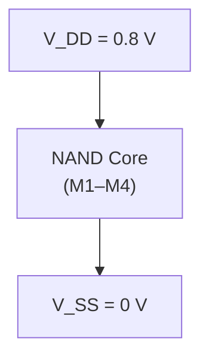
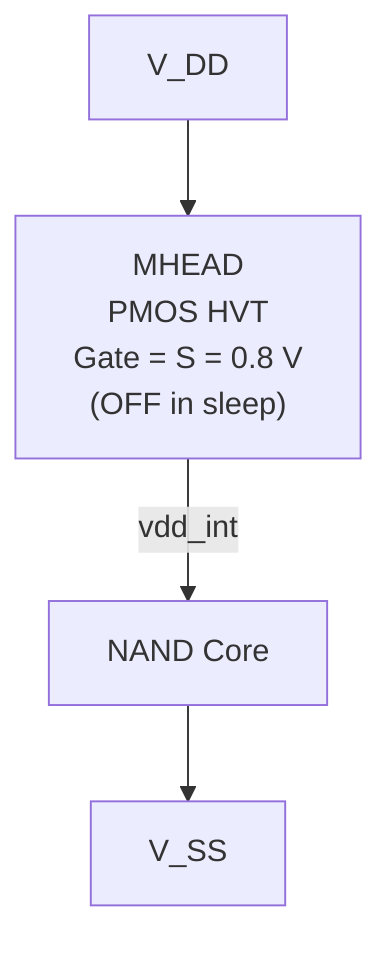
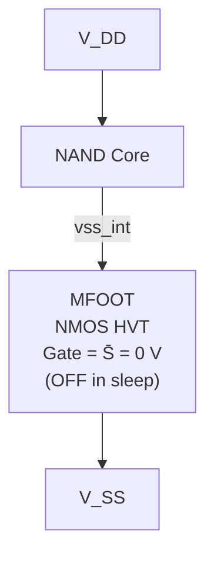
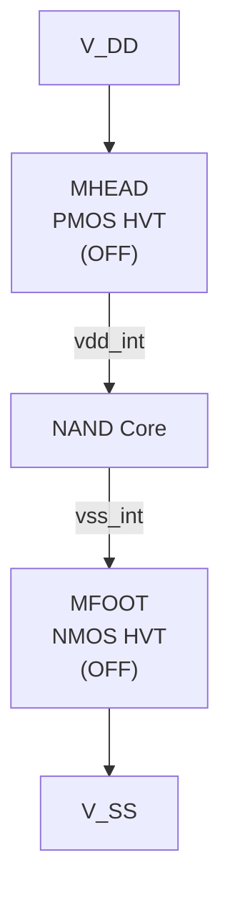

# Exercise 6 — NAND Gate Leakage in Sleep Mode

## Objective

Quantify the static (sub-threshold) leakage current of a 2-input CMOS NAND gate at 22 nm and evaluate how **high-$V_T$ (HVT) power-gating** devices — inserted as a header, a footer, or both — suppress that leakage during sleep mode.

---

## Design Parameters

| Parameter | Value |
|---|---|
| Technology | 22 nm PTM-HP |
| $V_{DD}$ | 0.8 V |
| $W_n$ | 44 nm |
| $L_n = L_p$ | 22 nm |
| Sizing ratio $k$ | 1.30 |
| $W_p = kW_n$ | 57.2 nm |
| HVT $V_T$ | 1.5 × nominal $V_T$ |

> **Note:** For the PMOS HVT device the **magnitude** of $V_T$ is scaled by 1.5×, as specified by the professor.

---

## Background — Why Leakage Matters at 22 nm

At deep-submicron nodes, **sub-threshold leakage** becomes a dominant source of standby power. Even when a logic gate is idle, transistors that are nominally OFF still conduct a small current that grows exponentially as $V_T$ shrinks with scaling.

**Power gating** mitigates this by inserting a series switch — a high-$V_T$ transistor — between the logic block and the supply rail (header) or ground rail (footer). In sleep mode, this switch is turned OFF, and its elevated threshold voltage exponentially reduces the leakage current through the entire stack.

---

## NAND Gate Topology

The baseline 2-input CMOS NAND gate consists of two parallel PMOS devices (pull-up) and two series NMOS devices (pull-down):

```
        VDD (or vdd_int)
         │
    ┌────┴────┐
    │         │
  ┌─┤M1 (P)  ├─┐   ┌─┤M2 (P)  ├─┐
  │ │  A      │ │   │ │  B      │ │
  │ └────┬────┘ │   │ └────┬────┘ │
  │      └──────┴───┴──────┘      │
  │              │                │
  │             out               │
  │              │                │
  │         ┌────┴────┐           │
  │         │M4 (N)   │           │
  │         │  B      │           │
  │         └────┬────┘           │
  │              │                │
  │             mid               │
  │              │                │
  │         ┌────┴────┐           │
  │         │M3 (N)   │           │
  │         │  A      │           │
  │         └────┬────┘           │
  │              │                │
        GND (or vss_int)
```

---

## Input States

All four logic combinations of inputs A and B are simulated via a nested parametric DC sweep:

| State | A | B | Expected Output |
|:---:|---:|---:|:---:|
| 00 | 0 V | 0 V | 1 (HIGH) |
| 01 | 0 V | 0.8 V | 1 (HIGH) |
| 10 | 0.8 V | 0 V | 1 (HIGH) |
| 11 | 0.8 V | 0.8 V | 0 (LOW) |

---

## Circuit Configurations

Four circuit variants were simulated, each adding progressively more aggressive leakage suppression:

### Circuit A — Baseline NAND (No Power Gating)

The standard CMOS NAND gate connected directly between $V_{DD}$ and $V_{SS}$.



**Netlist:** [`nand_leakage_a.scs`](./netlists/nand_leakage_a.scs)

### Circuit B — PMOS HVT Header

A PMOS HVT transistor (MHEAD) is inserted between $V_{DD}$ and the NAND core. In sleep mode, $S = V_{DD} = 0.8$ V, so $V_{GS} = 0$ and the header is OFF.



**Netlist:** [`nand_leakage_b.scs`](./netlists/nand_leakage_b.scs)

### Circuit C — NMOS HVT Footer

An NMOS HVT transistor (MFOOT) is inserted between the NAND core and $V_{SS}$. In sleep mode, $\overline{S} = 0$ V, so $V_{GS} = 0$ and the footer is OFF.



**Netlist:** [`nand_leakage_c.scs`](./netlists/nand_leakage_c.scs)

### Circuit D — PMOS HVT Header + NMOS HVT Footer

Both a PMOS HVT header and an NMOS HVT footer isolate the NAND core from both supply rails. In sleep mode, both gating devices are OFF:

$$V_G(\text{PMOS header}) = 0.8\text{ V}, \quad V_G(\text{NMOS footer}) = 0\text{ V}$$



The virtual nodes $vdd\_int$ and $vss\_int$ float to intermediate voltages determined by the leakage balance within the circuit.

**Netlist:** [`nand_leakage_d.scs`](./netlists/nand_leakage_d.scs)

---

## Simulation Methodology

1. **Analysis type:** Spectre DC operating-point analysis (`dc` statement).
2. **Parametric sweep:** Nested sweeps of `VINA` and `VINB` over `[0, 0.8]` V to enumerate all four input states.
3. **Leakage extraction:** The supply current $I_{DD}$ is read from the `VDD_SRC:p` terminal current. Its magnitude gives the total static leakage.
4. **Convergence tightening (Circuit D only):** Because Circuit D leakage falls into the pA range, default solver tolerances can introduce numerical noise. Tighter options were applied:

```spectre
.options gmindc=1e-15 iabstol=1e-15 reltol=1e-4
```

---

## Results

### Leakage Current Summary

All values in **nA** (magnitudes of $I_{DD}$):

| Input State | Circuit A | Circuit B | Circuit C | Circuit D |
|:---:|---:|---:|---:|---:|
| 00 | 0.0607 | 0.00817 | 0.01271 | 0.000960 |
| 01 | 1.027 | 0.00765 | 0.00999 | 0.000642 |
| 10 | 4.144 | 0.00781 | 0.01115 | 0.000466 |
| 11 | 12.122 | 0.00282 | 0.01131 | 0.000102 |

### Leakage Reduction Ratios (relative to Circuit A)

| Input State | B : A | C : A | D : A |
|:---:|---:|---:|---:|
| 00 | 7.4× | 4.8× | 63× |
| 01 | 134× | 103× | 1,600× |
| 10 | 531× | 372× | 8,900× |
| 11 | **4,300×** | **1,070×** | **118,800×** |

> Circuit D achieves nearly **five orders of magnitude** leakage reduction in the worst-case input state (AB = 11).

### Virtual Node Voltages in Sleep Mode

When power-gating devices are OFF, the internal virtual supply/ground nodes float to intermediate voltages, effectively reducing the voltage across the NAND core and further suppressing leakage.

| Input State | Circuit B: $vdd\_int$ (mV) | Circuit C: $vss\_int$ (mV) | Circuit D: $vdd\_int$ (mV) | Circuit D: $vss\_int$ (mV) |
|:---:|---:|---:|---:|---:|
| 00 | 84 | 127 | 250 | 119 |
| 01 | 95 | 269 | 304 | 297 |
| 10 | 98 | 203 | 350 | 159 |
| 11 | 531 | 673 | 589 | 381 |

These floating voltages reveal that the effective $V_{DD}$ across the NAND core is dramatically compressed — for example, in Circuit D at AB = 00, the core sees only $250 - 119 = 131$ mV instead of the full 800 mV.

---

## Discussion

### Why AB = 11 Is the Worst-Case Leakage State

In input state AB = 11, both NMOS transistors (M3 and M4) are fully ON, creating a low-impedance pull-down path. The output node is driven LOW, and the dominant leakage flows through the two PMOS devices (M1 and M2), which are both in sub-threshold. Since the PMOS devices see $V_{GS} = 0$ and $V_{DS} \approx -V_{DD}$, a large sub-threshold drain current results. The stacking of two ON NMOS devices presents negligible series resistance, so essentially the full $V_{DD}$ appears across the OFF PMOS devices.

In contrast, for AB = 00, both NMOS devices are OFF (sub-threshold) and stacked in series, while the PMOS devices are ON. The leakage must traverse two OFF NMOS devices in series — their sub-threshold resistances add, and the intermediate node voltage redistributes, yielding much lower net leakage.

### Header vs. Footer Effectiveness

**Circuit B (header)** is more effective than **Circuit C (footer)** at the worst-case state (AB = 11): 4,300× reduction vs. 1,070×. This is because at AB = 11, the dominant leakage path is through the OFF PMOS devices pulling current from $V_{DD}$. The HVT header directly strangles this supply-side current.

Conversely, at AB = 00, the footer (Circuit C) provides stronger suppression of the ground-side leakage through the OFF stacked NMOS path.

### Circuit B and C Leakage Is Remarkably Flat

Notice that Circuit B's leakage spans only a 3× range across all input states (2.82–8.17 pA), compared to Circuit A's 200× range (0.061–12.1 nA). The HVT header clamps the total supply current to a nearly input-independent ceiling, because the header's own sub-threshold current becomes the bottleneck regardless of the NAND core's internal state. The same argument applies to Circuit C's footer.

### Double Gating in Circuit D

Circuit D combines both barriers. The leakage current must traverse **two** HVT devices in series — one on the supply side, one on the ground side. This provides multiplicative suppression. Additionally, the floating virtual nodes compress the effective supply voltage across the NAND core (as seen in the virtual node voltage table), creating a third mechanism of leakage reduction beyond just the elevated $V_T$.

---

## Key Takeaways

- Sub-threshold leakage at 22 nm HP is highly input-state-dependent (200× variation in the baseline NAND).
- A **single HVT power-gating device** (header or footer) reduces leakage by **1–3 orders of magnitude** and dramatically flattens the input-state dependence.
- **Dual power gating** (header + footer) achieves up to **~5 orders of magnitude** leakage reduction, with the virtual supply nodes collapsing to reduce the effective core voltage.
- Convergence settings must be tightened when extracting pA-level currents to avoid numerical artifacts.

---

## File Manifest

### Spectre Netlists

| File | Configuration |
|---|---|
| [`nand_leakage_a.scs`](./netlists/nand_leakage_a.scs) | Circuit A — Baseline NAND |
| [`nand_leakage_b.scs`](./netlists/nand_leakage_b.scs) | Circuit B — PMOS HVT header |
| [`nand_leakage_c.scs`](./netlists/nand_leakage_c.scs) | Circuit C — NMOS HVT footer |
| [`nand_leakage_d.scs`](./netlists/nand_leakage_d.scs) | Circuit D — Header + footer |

### Simulation Data (CSV)

| File | Contents |
|---|---|
| [`parta.vcsv`](./csv/parta.vcsv) | Circuit A — node voltages and $I_{DD}$ |
| [`NAND_LEAKAGE_B.vcsv`](./csv/NAND_LEAKAGE_B.vcsv) | Circuit B — includes $vdd\_int$ |
| [`nand_leakage_C.vcsv`](./csv/nand_leakage_C.vcsv) | Circuit C — includes $vss\_int$ |
| [`nand_leakage_d.vcsv`](./csv/nand_leakage_d.vcsv) | Circuit D — includes $vdd\_int$ and $vss\_int$ |
