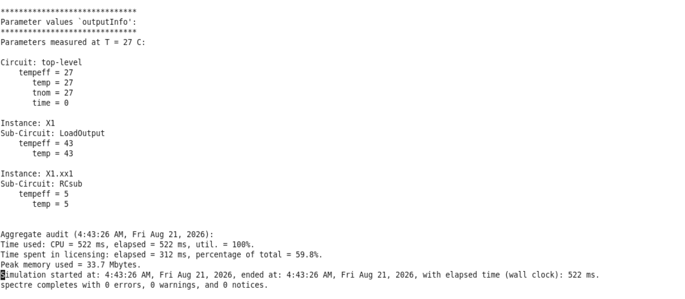
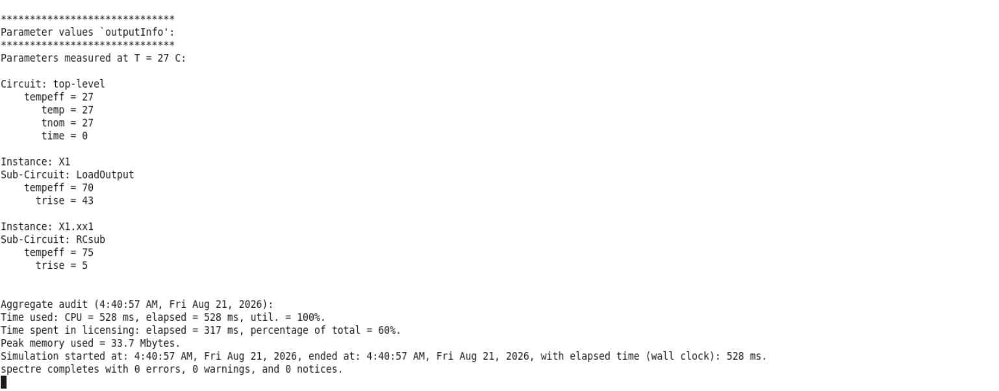
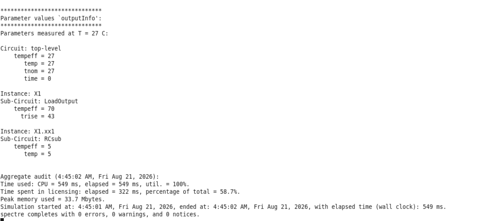

# Spectre: Temp vs Trise

A minimalistic demonstration of how temperature parameters interact in Cadence Spectre simulations.

## Overview

This demonstrates the fundamental differences between the `temp` and `trise` parameters in device models:

* **`temp`**: Sets the absolute operating temperature. It is **exclusive** (overrides ambient settings for the specific instance).
* **`trise`**: Represents the temperature rise. It is **accumulative** (adds up on top of the ambient or base temperature).

## Demonstrations

### 1. The Exclusive Nature of `temp`
When `temp` is defined, it sets a hard temperature value, ignoring background/ambient temperatures.

### 2. The Accumulative Effect of `trise`
When `trise` is used, the value is added to the ambient temperature.

### 3. Combined Effects
Simultaneous visualization showing how `trise` accumulates while `temp` acts exclusively.

## Simulation File
* `demo_temp.scs`: The Spectre netlist used to run these demonstrations by varying appropriate parameters.

---
*Maintained by: TheVoltageVikingRam*
